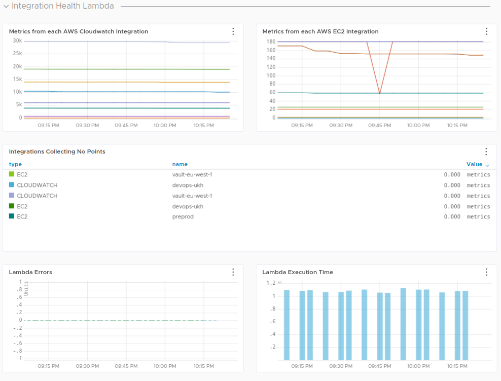

# Wavefront Integration Monitor

The number of metrics being pulled in by
[Wavefront](https://www.wavefront.com/)'s cloud integrations is reported by
the API, but is not, at the moment, exposed in Wavefront itself.

This directory contains a Lambda function which will query Wavefront's
`cloudintegration` API, extract the number of metrics fetched on the last
scrape, and feed that number, suitably tagged, back into Wavefront.

It lets you quickly make charts like this.



Hopefully Wavefront will give us better introspection of integrations soon,
but until then, there's this.

## Requirements

The [Serverless Framework](https://www.serverless.com), with the [Ruby
package](https://www.serverless.com/plugins/serverless-ruby-package/)
plugin.

## Configuration

You need the following values in Parameter Store:

| thing        | path                                     | encrypted?    |
|--------------|------------------------------------------|---------------|
| API token    | `/wavefront/integrationMonitor/token`    | yes           |
| API endpoint | `/wavefront/integrationMonitor/endpoint` | no            |

The token should belong to a service account with the *ingestion* and *proxy*
privileges. If either of these values are unset, the script will error.

You can set the metric path with the `WF_PATH` environment variable. It
defaults to `sre.wavefront.integrations`.

## Deployment

Install the Wavefront SDK gem with

```
$ bundle install
```

and, assuming you have sufficient AWS credentials, run

```
$ sls deploy
```

That's it.
